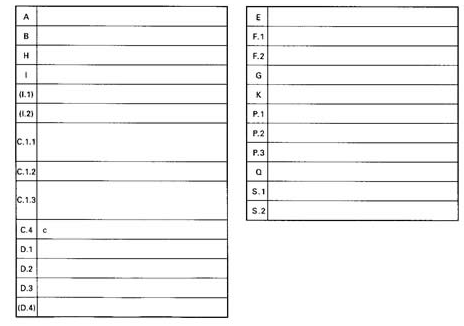
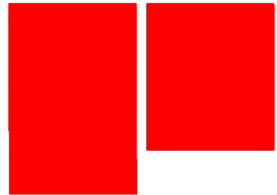
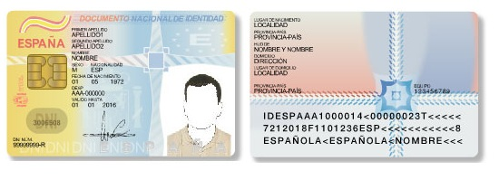
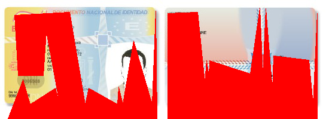
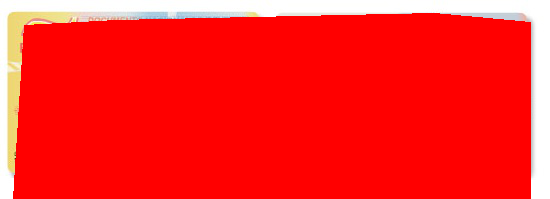
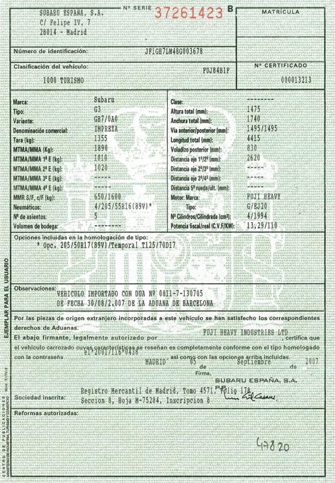
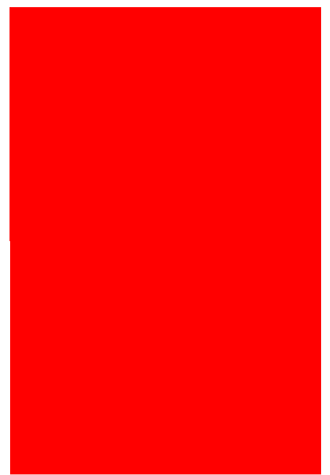

#contours.py

This module contains a set of functions to perform operations in an image using contours.
It can be used to find out features of the document for it's posterior clasification.

###Common arguments

These are some of the main arguments used in this module:

    - input_file: input file, can be a file path or an image (np array).
    - contours: set of contours, preferibly detected by detect_contours
    - contour, cnt1, cnt2: single contours.

###Import

To import this module into your application, you must include the following
line at the beginning of your own python file:

        import contours as cc

###Functions

In this section you'll find a summary of each function included in this module
except the *check_argument* functions, which always return either 0 or an
exception if any parameter is out of it's limits.

- ####contours_close(cnt1, cnt2, min_dist=20)

    - min_dist: max distance between contours to be considered "close".

    Returns: true or false.

- ####delete_border_noise(input_file, width=20, color=(255, 255, 255))

    Sets pixels of the outer border of the image in a color.

    Returns: the image with a border of *width* pixels in *color*

- ####delete_small_contours(contours, min_dim=1000)

    Delete the small contours from list.

    - min_dim: minimum contour dimension accepted.

    Returns: a list of contours with a *min_dim* dimension.

- ####detect_contours(input_file, thresh_val=255)

    Load the image in grayscale, applies adaptive threshold and then an erode operation
    so it creates "pixel blocks" which can be analyzed after to extract features.

    - thresh_val: max_val parameter of th.adaptive_mean_apply

    Returns: a list of contours.

- ####detect_corners(input_file, max_corners=10, min_dist=50, trust_val=0.5)

    Gets the corners using the goodFeaturesToTrack function. Works better when the image
    received as parameter has the "pixel blocks" already defined.

    - max_corners: maximum number of corners to detect.
    - min_dist: minimum distance between corners.
    - trust_val: value between 0 and 1, trust value of the pixel being a corner.

    Returns: a list of poinst which are probably corners.

- ####draw_contours(input_file, contours, thickness=0, color=(0, 0, 255))

    Draws the contours detected into the image with the thickness and color provided.

    - thickness: thickness of the contour, if negative the contour is filled.
    - color: color to draw the contour. Red by default.

    Returns: the input_file with the contours drawn on it.

- ####draw_corners(input_file, corners, radius=5, color=(0, 0, 255), thickness=-1)

    Draws the corners detected into the image with the radius, color and thickness specified.

    - radius: radius of the circle that will represent the corner.
    - color: color to draw the corner. Red by default.
    - thickness: thickness of the corner, if negative the circle is filled.

    Returns: the input_file with the corners drawn on it.

- ####get_contour_area(contour)

    Returns: the area of the contour calculated by OpenCV's function contourArea.

- ####get_contour_coord(contour)

    Returns: the coordinates of the contour.

- ####get_contour_dimension(contour, closed=1)

    - closed: parameter to arcLength, indicates that the contour must have a closed form.

    Returns: the perimeter of the contour calculated by OpenCV's function arcLength.

- ####get_corner_number(input_file, max_corners=10, min_dist=20, trust_val=0.2)

    Returns: the length of the list returned by detect_corners.

- ####get_squares(contours, min_length=1000)

    Returns: a list of contours where only the elements inside *contours* which dimension
    is greater or equal to *min_length*

- ####get_square_number(contours, min_length=1000)

    Returns: the length of the list returned by get_squares.

- ####join_contours(contours, min_dist=20)

    Returns: a set of contours when the contours considered close by contours_close are
    joined into a single contour.

###Examples

In this section we are going to show a few examples to demonstrate some parts of the contours module. This module is the key to do classification operations with our documents as it provides several functions to detect the shape of the document and extract some features from it.

Let's start with a simple case:

If we use the detect_contours and then we draw them using *thickness=-1* we obtain:

In this case the contours have a perfect shape and we obtain the shape of both the tables from the image.

Now let's see what happens if our detected contours aren't square-shaped:

If we draw the contours just after we detect them:

It is obvious that this image won't be of much use to us if we try to obtain common features from this type of document, but you might notice that both contours detected are similar.

Let's see what happens if after finding the contours we transform then into squares by using *get_squares()* and after we use *join_contours()*

To our last contour-based example we are going to use this image:

The contours detected with *detect_contours()* are not completely squared, and there are also some small contours that will be nothing but noise to us:

We can use the *join_contours()* and *delete_small_contours()* function so we get:

Note: you might want to draw the contours in a new white image to delete external noise before analyzing the contour.

Finally, here's an example of corner detection (*detect_corners()* and *draw_corners()*). Let's apply it to our first image:

