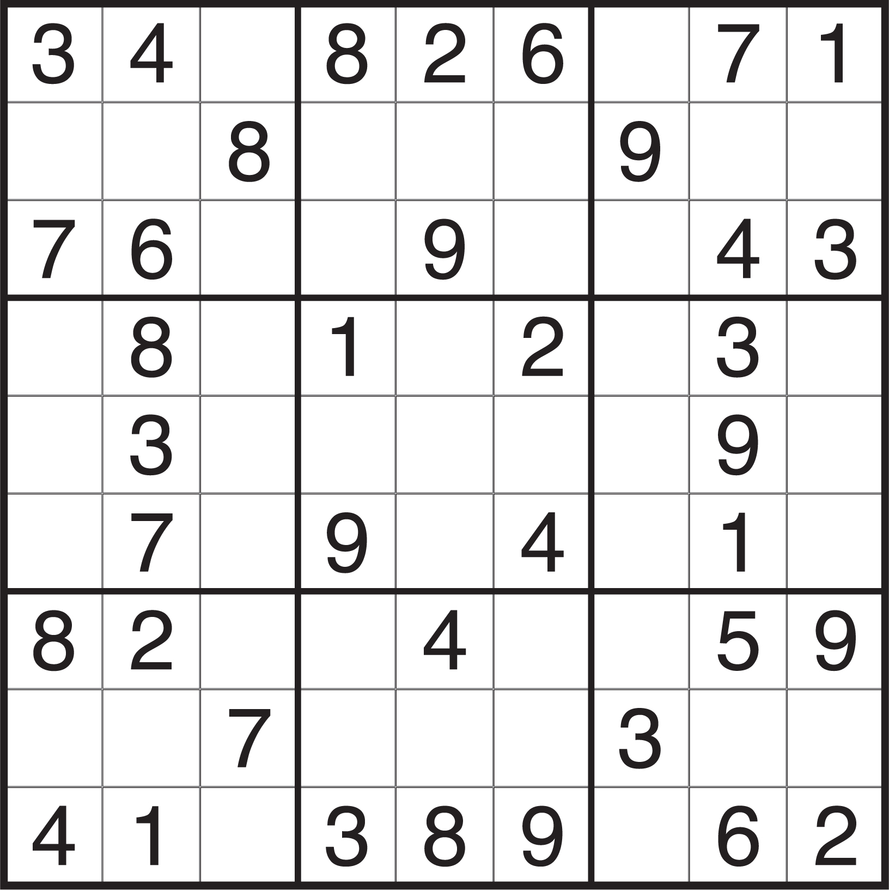
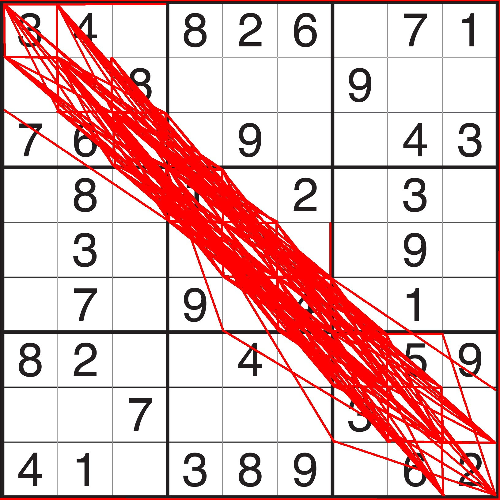

#lines_detection.py

This module allows to perform several operations to implement line detection and
some line operations in documents.
It is based on the Standard Hough Line Transform and also on the Probabilistic
Hough Line Transform implemented on OpenCV.

###Common arguments

These are some of the main arguments used in this module:

    - input_file: the path to the image or directly the image to perform lines operations on it.
    - probabilistic: boolean argument, False if Standard, True if Probabilistic.
    - lines: a list of lines.
    - lineX: where X is a number. A single line.
    - line_length: the length of each line of the image.
    - width: the width of the line drawn.
    - color: the color of the line drawn.
    - error: a margin of error of deviation of the lines. Sometimes not every
             pixel on a line is recognized as part of one, resulting in lines
             that may move some coordinates a few pixels even if the line is
              vertical or horizontal. On pixels.

###Import

To import this module into your application, you must include the following
line at the beginning of your own python file:

        import lines_detection as ld

###Functions

In this section you'll find a summary of each function included in this module
except the *check_argument* functions, which always return either 0 or an
exception if any parameter is out of it's limits.

- ####delete_all_lines(input_file, probabilistic=False, min_val=50, max_val=200, aperture_size=3, rho=1, theta=np.pi/180, threshold=200, min_line_length=30, max_line_gap=20, line_length=1000, width=5, color=(255, 255, 255)):

    Uses the *delete_lines* function in a loop to delete all lines detected until no
more lines can be found in the image with *detect_lines*.

    Returns: a new image which is the input image with the lines drawn in the selected color.

- ####delete_lines(input_file, lines, line_length = 1000, width = 5, color = (255,255,255)):

    Deletes the lines received by drawing them in the same color as the document's
background.

    Returns: a new image which is the input image with the lines drawn in the selected
    color.

- ####detect_lines(input_file, probabilistic=False, min_val=50, max_val=200, aperture_size=3, rho=1, theta=np.pi/180, threshold=200, min_line_length=30, max_line_gap=20, line_length=1000, width=5, color=(255, 255, 255)):

    Uses Canny + HoughLines/HoughLinesP function to detect lines in an image.

    - min_val: if intensity gradient lesser than min_val, the point is not an edge.
    - max_val: if intensity gradient greater than max_val, the point is an edge.
    - aperture_size: size of Sobel kernel used for find image gradients.
    - rho: the resolution of the parameter rho in pixels.
    - theta: the resolution of the parameter theta in radians.
    - threshold: the minimum number of intersections to "detect" a line.
    - minLineLength: the minimum  
    - maxLineGap: maximum gap between two points to be considered in the same line.

    Returns: a list of lines; each line is a set of two (standard) or four (prob) coordinates.

- ####distance(line1, line2, probabilistic=False, line_length = 1000):

    Calculates the absolute distance between two lines that must be parallels.

    Returns: [distance_x_axis, distance_y_axis]

- ####distance_mean(lines, probabilistic=False, line_length = 1000):

    Calculates the mean distance between a set of lines.

    Returns: [mean_distance_x_axis, mean_distance_y_axis]

- ####draw_lines(input_file, lines, probabilistic=False, line_length = 1000, width=5, color=(0,0,255)):

    Draws the lines into the input image in the selected color.

    Returns: input image with the input lines drawn on it in the selected color.

- ####get_line_coordinates(line, probabilistic=False, line_length = 1000):

    Calculates the coordinates of the line received given a the line coordinates.

    Returns: [x1, y1, x2, y2] a set of coordinates that represents the line.

- ####line_count(lines, probabilistic=False, line_length = 1000, error = 5):

    Counts the total of lines, and checks how many horizontal and vertical lines are.
A line is considered horizontal or vertical if it's coordinates (Y or X
respectively) is constant (+- error argument value).

    Returns: [total, num_vertical_lines, num_horizontal_lines]

- ####parallels(line1, line2, probabilistic=False, line_length = 1000, error = 5):

    Checks if two lines are parallels, within an expected margin of error in pixels.

    Returns: True or false.

###Examples

In this case, the important thing is the difference between both sets of lines detected (standard and probabilistic).

Let's use this sudoku as example:

This are the lines detected by default:

And this are the ones detected by a probabilistic approach:

Although this example may induce you to think that the probabilistic approach isn't a valid one, you might face images where the probabilistic approach is way better than the standard.
